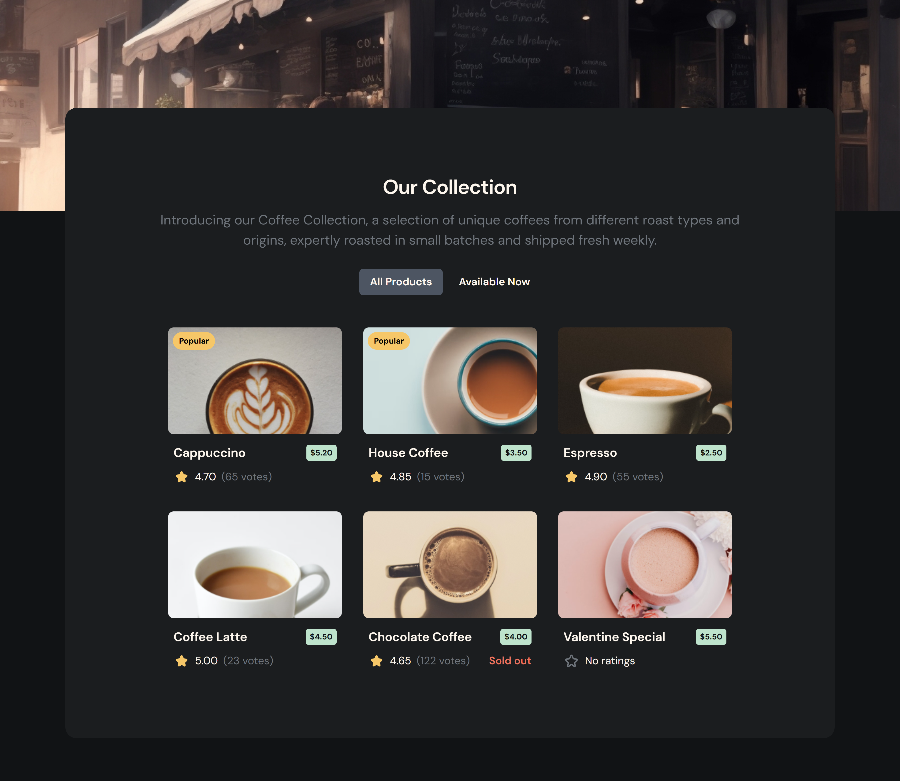

<h1 align="center">Simple Coffee Listing Page</h1>

   Solution for a challenge from  <a href="http://devchallenges.io" target="_blank">Devchallenges.io</a>.

  <h3>
    <a href="https://simple-coffee-listing-topaz.vercel.app/">
      Demo
    </a>
     | 
    <a href="https://github.com/ShrutiShinde418/simple-coffee-listing">
      Solution
    </a>
     | 
    <a href="https://devchallenges.io/challenge/simple-coffee-listing">
      Challenge
    </a>
  </h3>

<!-- TABLE OF CONTENTS -->

## Table of Contents

- [Table of Contents](#table-of-contents)
- [Overview](#overview)
  - [Screenshot](#screenshot)
  - [The challenge](#the-challenge)
  - [Built With](#built-with)
  - [Links](#links)
  - [What I learned](#what-i-learned)
  - [Continued development](#continued-development)
- [Author](#author)

<!-- OVERVIEW -->

## Overview

### Screenshot

### The challenge

You should create a web page that includes the following elements:

- Create a coffee listing page that matches the given design.
- Use React or other Front-end libraries for this challenge.
- Create a Reusable Card component.
- The card component should include a picture, name, pricing, rating, and number of votes if exists.
- The card component should render popular tag, availability status conditionally.
- Render Coffee list with given data. The data should come from a given API or downloaded JSON file.
- Users can choose to list all products or just available products.
- Deploy the solution and submit both the Repository URL and Demo URL.

### Built With

- React.js
- Chakra UI

### Links

- Solution URL: [https://github.com/ShrutiShinde418/simple-coffee-listing](https://github.com/ShrutiShinde418/simple-coffee-listing)
- Live Site URL: [https://simple-coffee-listing-topaz.vercel.app/](https://simple-coffee-listing-topaz.vercel.app/)

### What I learned

- Chakra UI
- How to fetch data from an API in React
- Filtering Data in React

### Continued development

- React.js

## Author

- Website - [Portfolio](https://portfolio-devchallenges-henna.vercel.app/)
- Frontend Mentor - [@ShrutiShinde418](https://www.frontendmentor.io/profile/ShrutiShinde418)
